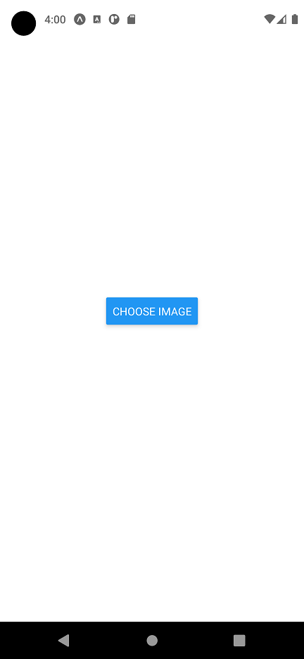
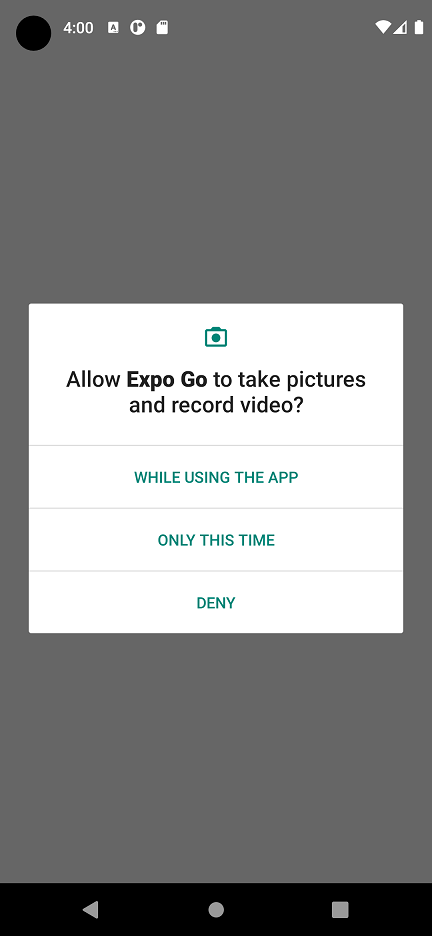
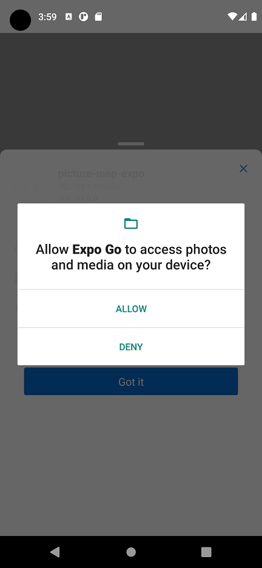
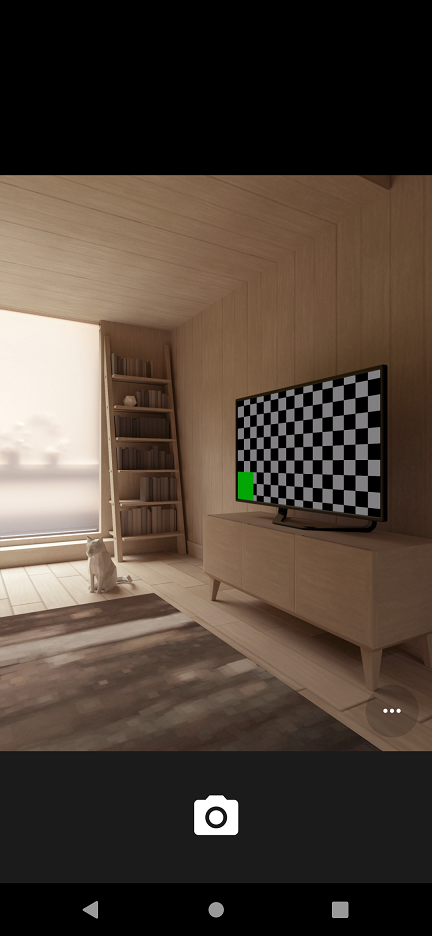
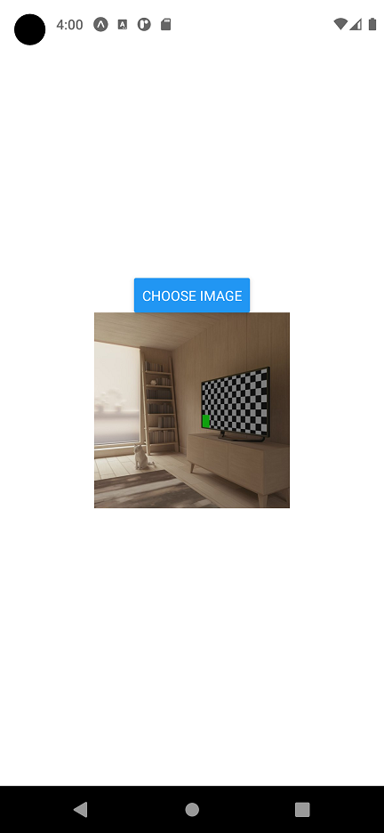

# Desarrollo de la Actividad 7

Nombre: Guillermo Echagüe


## Instalar Expo en Local Instalar Expo en Local

Primero instalamos con npm explo-cli y exp (debemos de tener Node.js y npm instalados)
```bash
npm install -g expo-cli exp
```


## Inicio de proyecto
```bash
expo init picture-map-expo
```

To run your project, navigate to the directory and run one of the following yarn commands.

```bash
- cd picture-map-expo
- yarn start # you can open iOS, Android, or web from here, or run them directly with the commands below.
- yarn android
- yarn ios # requires an iOS device or macOS for access to an iOS simulator
- yarn web
```

## Dependencias del proyecto
```bash
expo install expo-image-picker
expo install expo-constants
```

### Funciones de App


### Home App


### Permiso 1 App


### Permiso 2 App


### Camara App


### Home foto App
